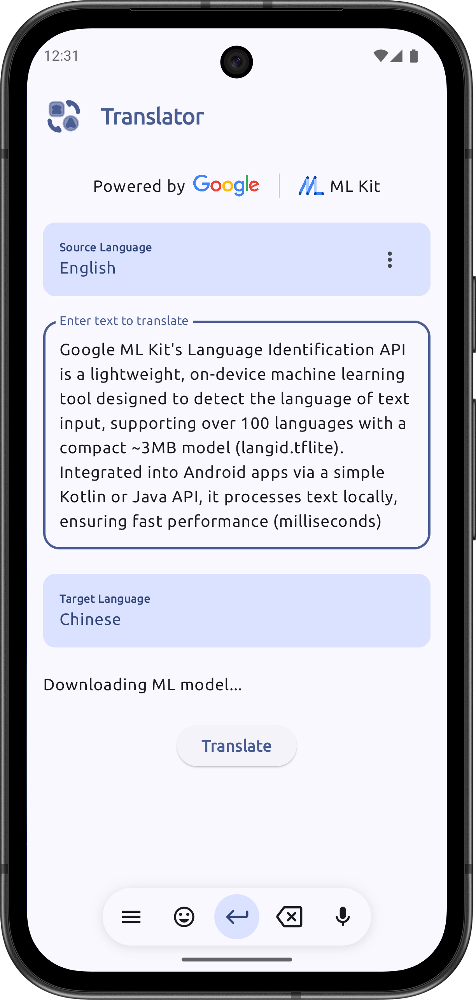
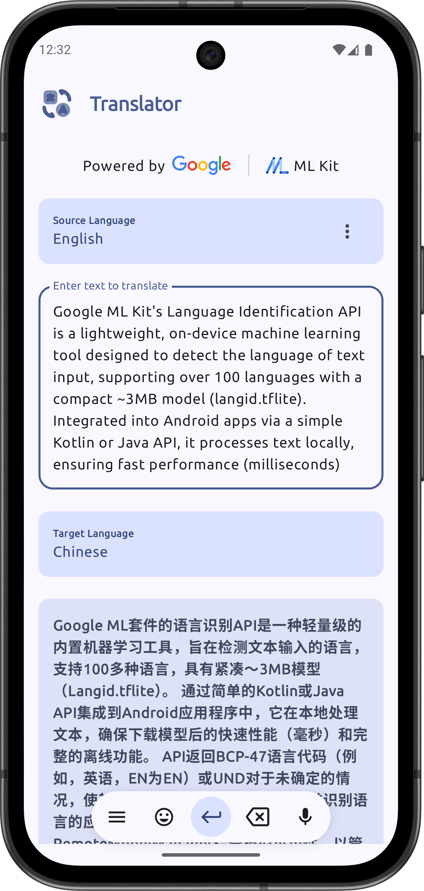
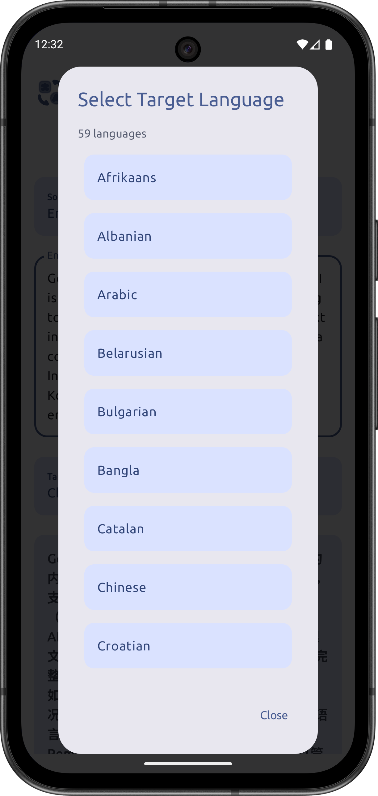
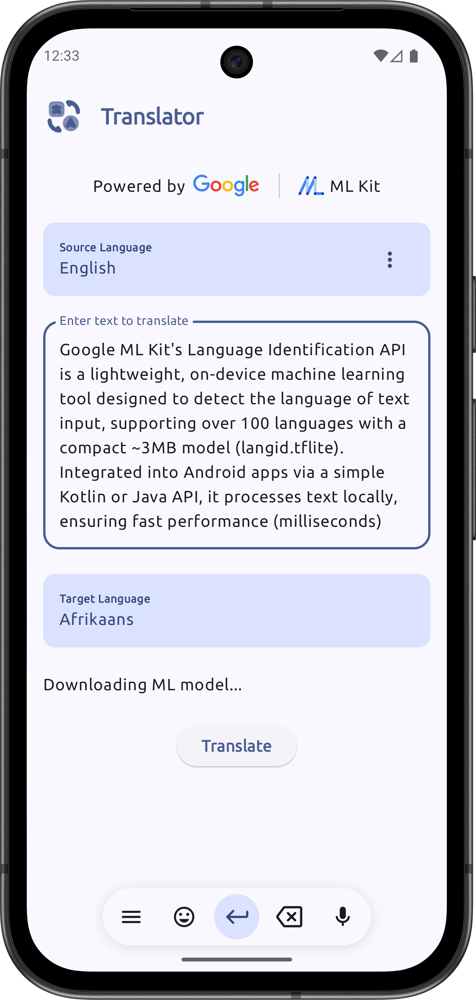
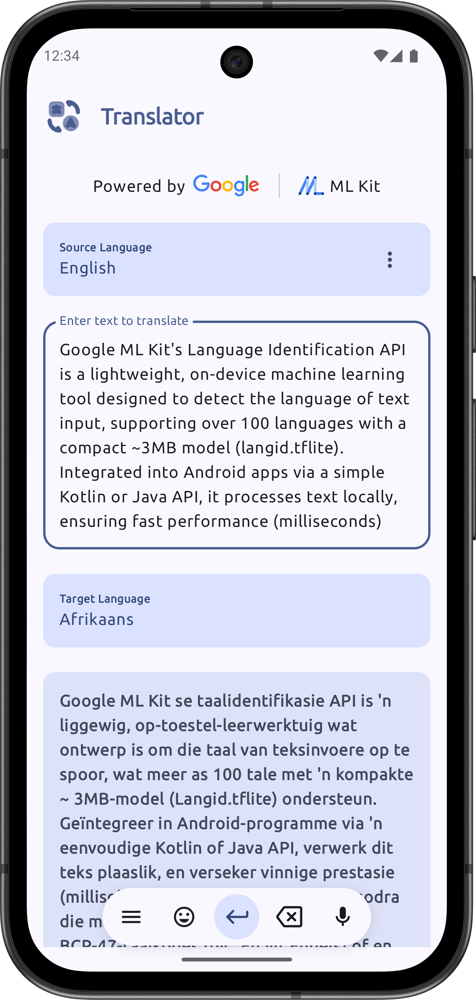

# Translator

**Translator** is an Android application demonstrating on-device machine learning capabilities for
language translation. It leverages Google's ML Kit to provide seamless and efficient language
detection and translation.

## Features

* **Language Detection:** Automatically identifies the language of the input text.
* **Text Translation:** Translates text into a wide variety of target languages.
* **On-Device ML:** Utilizes ML Kit's on-device models for fast and offline-capable translation.

## Tech Stack

* **Kotlin:** Primary programming language.
* **Jetpack Compose:** Modern UI toolkit for building native Android UIs.
* **ML Kit:**
    * Language ID
    * Translation
* **Hilt:** For dependency injection.
* **Coroutines & Flow:** For asynchronous operations.

## Screenshots

