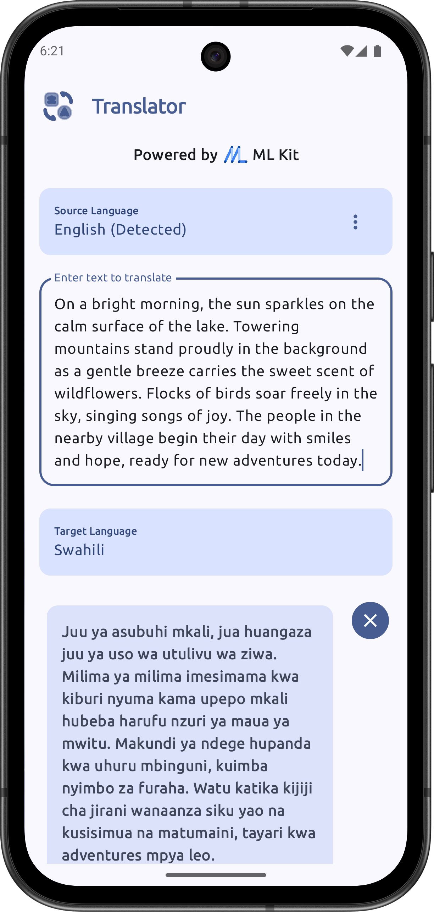
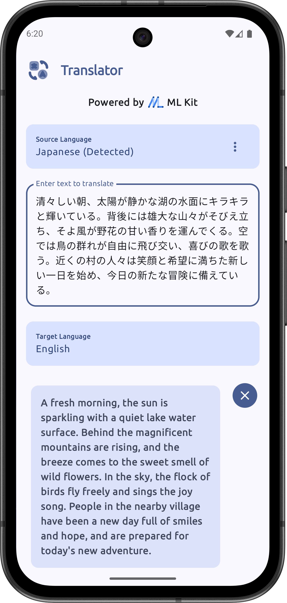

# Translator

**Translator** is a modern, adaptive Android application designed for seamless language translation. It leverages Google's ML Kit for on-device machine learning, ensuring privacy and offline capability.

## Features

*   **Smart Translation:** Instantly translate text between multiple languages with automatic language detection.
*   **On-Device Privacy:** All translations happen on your device using ML Kit, keeping your data private and working offline.
*   **History & Favorites:** Automatically save your translation history and "Star" important phrases for quick future access.
*   **Dictionary:** Integrated dictionary with definitions, synonyms, and usage examples.
*   **Word of the Day:** Learn something new every day with a featured word card.
*   **Adaptive UI:** A responsive design that works beautifully on phones, foldables, and tablets.

## Tech Stack

*   **Kotlin:** Primary programming language.
*   **Jetpack Compose:** Modern UI toolkit for building native Android UIs.
*   **Material 3:** Latest Material Design components and theming.
*   **ML Kit:**
    *   Language ID
    *   Translation
*   **Hilt:** Dependency injection.
*   **Room Database:** Local storage for history and favorites.
*   **Coroutines & Flow:** Asynchronous operations.

## Screenshots

|                                         Translation                                          |                                Language Selection                                 |
|:--------------------------------------------------------------------------------------------:|:---------------------------------------------------------------------------------:|
|  |  |

|                                    Dictionary                                     |                                Word of the Day                                |
|:---------------------------------------------------------------------------------:|:-----------------------------------------------------------------------------:|
|  |  |

|                                     History                                     |                                      Japanese to English                                       |
|:-------------------------------------------------------------------------------:|:----------------------------------------------------------------------------------------------:|
|  |  |
